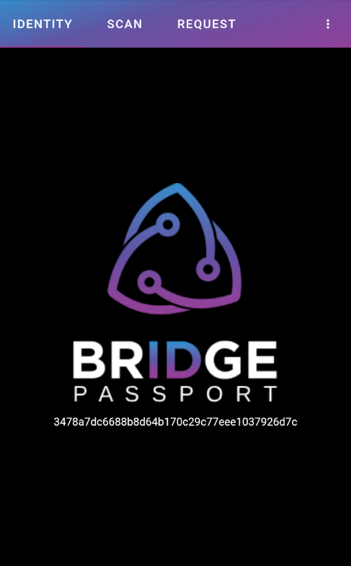

  

<h3 align="center">Bridge Passport Mobile</h3>

# Summary
Bridge Passport Mobile enables end users to sync their Bridge Passport to their mobile device to use their Bridge Identity on the go.

# User Guide and Feature Documentation
View the <a href="https://bridgeprotocol.io/docs/mobile">Bridge Identity Documentation</a> to get started.

# Local Build and Run
Follow instructions to configure Apache Cordova and Android Studio:
https://cordova.apache.org/docs/en/latest/guide/cli/

After Apache Cordova and Android Studio is configured:
- "npm i"
- "cordova run android"
